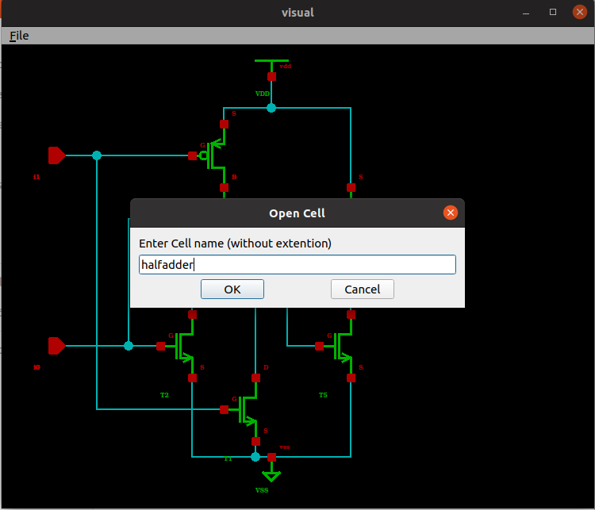

### Coding Style 🖊
The code is written following the WebKit coding style (formatted with clang-format).
 
 
### Build and Run the program 🔨
 
First you need to install the necessary libraries.
 
```
sudo apt update
sudo apt install libxml2-dev
sudo apt install qt5-default
 
```
 
 
Then call CMake to generate the build pipeline for this project.
 
In the project directory enter the following commands:
 
```
cd build/
cmake ../src
```
 
Now you can start building the project.
 
 
```
make install
 
```
 
*This may take some time to finish !*
 
 
Once the application program is generated, you will need to enter the "work" directory to run the program.  This directory contains "cell" directory which in turn contains the xml files needed by the application.
```
cd ../work
../install/bin/visual
 
```
 
### Use the application 🎮
 
*Note that we defined OR and AND gates at the transistor level for illustration purposes (take a look at the xml files). The XOR gate is represented at RTL only and thus cannot be displayed on its own.*
 
In the menu bar click on **File->Cells Library** (or just Ctrl+L). In the new window that showed up, choose AND or OR gate then click on Load.
 
*You can now visualise the netlists of the different circuits.*


Use the arrows to move in the viewport.
 
You can view the different instances that compose your circuit by clicking on  **File->Instances** 

 

In the main function we did not load all xml files. You can load the one you want by You by clicking on  **File->Open**  then typing `halfadder` in the box dialog. This will
You can now load another circuit like `fulladder`.
Note that you have to load the halfadder before the fulladder because the former is an instance of the latter.



You can also save the data structure of the circuit you opened in an new xml file by clicking on  **File->Save**  then typing the name you want. This is particularly helpful if you build your circuit in the main function and want to store it in a file.


 
